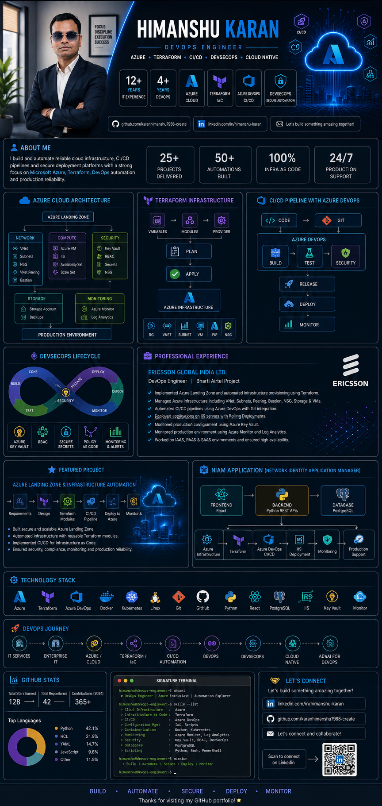
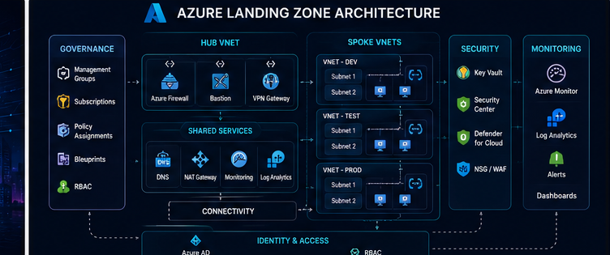
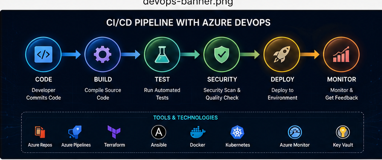
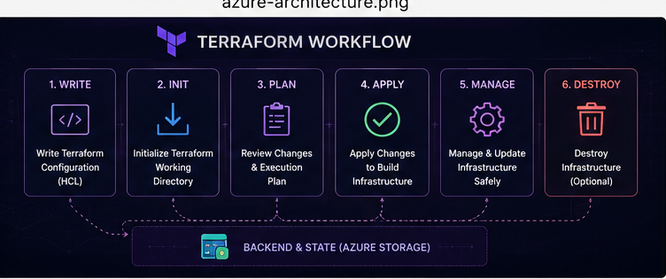
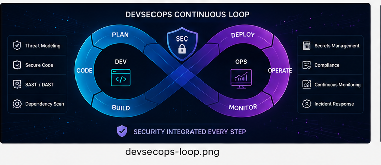
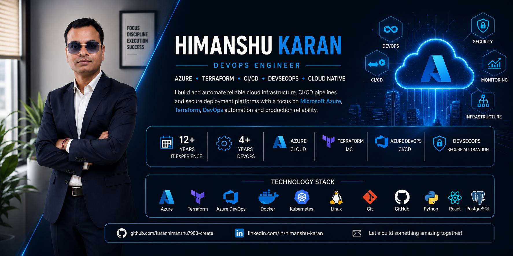

  

# 👋 Hi, I'm **Himanshu Karan**

### 🚀 DevOps Engineer | Azure | Terraform | CI/CD | DevSecOps

&nbsp;

&nbsp;

---

## ⚡ DEVOPS COMMAND CENTER

<table>
<tr>
<td align="center">☁️ <b>AZURE</b> Cloud Infrastructure</td>
<td align="center">🏗️ <b>TERRAFORM</b> Infrastructure as Code</td>
<td align="center">🔄 <b>CI/CD</b> Azure DevOps</td>
<td align="center">🔐 <b>DEVSECOPS</b> Secure Automation</td>
<td align="center">📊 <b>OBSERVABILITY</b> Monitor & Analyze</td>
</tr>
</table>

---

## 👨‍💻 WHOAMI

<table>
<tr>

<td width="55%" valign="top">

### HIMANSHU KARAN

**DevOps Engineer**

- 🏢 Ericsson Global India Ltd.
- 📡 Bharti Airtel Project
- ☁️ Microsoft Azure
- 🏗️ Terraform Infrastructure as Code
- 🔄 Azure DevOps CI/CD
- 🔐 DevSecOps
- 🌐 Cloud Infrastructure
- 🖥️ Azure Virtual Machines
- 🔑 Azure Key Vault
- 📊 Azure Monitor & Log Analytics
- 🚀 Production Deployment & Automation

</td>

<td width="45%" valign="top">

~~~text
┌─────────────────────────────┐
│       DEVOPS PROFILE        │
├─────────────────────────────┤
│ CLOUD       : AZURE         │
│ IaC         : TERRAFORM     │
│ CI/CD       : AZURE DEVOPS  │
│ SECURITY    : DEVSECOPS     │
│ MONITORING  : AZURE MONITOR │
│ NETWORK     : AZURE VNET    │
│ COMPUTE     : AZURE VM      │
│ STATUS      : ● ONLINE      │
└─────────────────────────────┘
~~~

</td>

</tr>
</table>

> I build and automate reliable cloud infrastructure, CI/CD pipelines and secure deployment platforms with a strong focus on Microsoft Azure, Terraform, DevOps automation and production reliability.

---

## ☁️ CLOUD COMMAND CENTER

~~~text
                         ┌───────────────────┐
                         │    AZURE CLOUD    │
                         └─────────┬─────────┘
                                   │
          ┌────────────────────────┼────────────────────────┐
          │                        │                        │
          ▼                        ▼                        ▼
   ┌──────────────┐        ┌──────────────┐        ┌──────────────┐
   │   NETWORK    │        │   COMPUTE    │        │   SECURITY   │
   ├──────────────┤        ├──────────────┤        ├──────────────┤
   │ VNet         │        │ Azure VM     │        │ Key Vault    │
   │ Subnet       │        │ IIS          │        │ RBAC         │
   │ NSG          │        │ Bastion      │        │ Secrets      │
   │ VNet Peering │        └──────────────┘        └──────────────┘
   └──────────────┘
                                   │
                                   ▼
                         ┌───────────────────┐
                         │   OBSERVABILITY   │
                         ├───────────────────┤
                         │ Azure Monitor     │
                         │ Log Analytics     │
                         └───────────────────┘
~~~

---

## 🔄 DEVOPS AUTOMATION ENGINE

~~~text
       ┌─────────┐
       │  CODE   │
       └────┬────┘
            │
            ▼
       ┌─────────┐
       │   GIT   │
       └────┬────┘
            │
            ▼
   ┌─────────────────┐
   │  AZURE DEVOPS   │
   │     CI / CD     │
   └────────┬────────┘
            │
      ┌─────┼─────┐
      ▼     ▼     ▼
    BUILD  TEST  SECURITY
      │     │     │
      └─────┼─────┘
            │
            ▼
     ┌──────────────┐
     │  TERRAFORM   │
     │ PLAN / APPLY │
     └──────┬───────┘
            │
            ▼
       ┌──────────┐
       │  DEPLOY  │
       └────┬─────┘
            │
            ▼
       ┌──────────┐
       │ MONITOR  │
       └────┬─────┘
            │
            └───────────────↺
~~~

---

## 🏗️ INFRASTRUCTURE AS CODE

### TERRAFORM

~~~text
                         TERRAFORM
                             │
              ┌──────────────┼──────────────┐
              ▼              ▼              ▼
         VARIABLES        MODULES        PROVIDER
              │              │              │
              └──────────────┼──────────────┘
                             ▼
                           PLAN
                             │
                             ▼
                           APPLY
                             │
                             ▼
                    AZURE INFRASTRUCTURE
~~~

| Terraform | Azure |
|---|---|
| Resource Groups | Azure Resource Groups |
| Virtual Networks | Azure VNet |
| Subnets | Azure Subnet |
| Public IP | Azure Public IP |
| Virtual Machines | Azure VM |
| Modules | Reusable Infrastructure |
| `for_each` | Scalable Resources |
| Dependencies | Resource Ordering |
| Variables | Configuration |
| Outputs | Infrastructure Information |

---

## 🔐 DEVSECOPS

~~~text
PLAN
  │
  ▼
CODE
  │
  ▼
BUILD
  │
  ▼
TEST
  │
  ▼
SECURITY
  │
  ▼
RELEASE
  │
  ▼
DEPLOY
  │
  ▼
MONITOR
  │
  ▼
IMPROVE
  │
  └──────────────────────↺
~~~

`🔐 AZURE KEY VAULT` • `🛡️ RBAC` • `🔒 SECURE CI/CD` • `🏗️ TERRAFORM` • `📊 MONITORING`

---

## 💼 PROFESSIONAL EXPERIENCE

### ERICSSON GLOBAL INDIA LTD.

**DEVOPS ENGINEER — BHARTI AIRTEL PROJECT**

~~~text
                    ENTERPRISE APPLICATION
                             │
                             ▼
                    AZURE LANDING ZONE
                             │
             ┌───────────────┼───────────────┐
             ▼               ▼               ▼
         NETWORKING       SECURITY       MONITORING
             │               │               │
             ▼               ▼               ▼
           VNet          Key Vault       Azure Monitor
             │                               │
             ▼                               ▼
          Subnets                       Log Analytics
             │
             ▼
         Azure VMs
             │
             ▼
       Application / IIS
             │
             ▼
         PRODUCTION
~~~

| AREA | EXPERIENCE |
|---|---|
| ☁️ Azure | Cloud Infrastructure & Azure Landing Zone |
| 🏗️ Terraform | Infrastructure as Code & Reusable Modules |
| 🔄 Azure DevOps | CI/CD Pipeline Automation |
| 🖥️ IIS | Application Deployment & Rolling Deployment |
| 🔐 Key Vault | Secret Management |
| 🌐 Networking | VNet, Subnet, Peering, Bastion, NSG |
| 📊 Monitoring | Azure Monitor & Log Analytics |
| 🛠️ Operations | Production Troubleshooting & Support |

---

## 🏆 FEATURED PROJECT

### AZURE LANDING ZONE & INFRASTRUCTURE AUTOMATION

~~~text
Developer
    │
    ▼
Git / GitHub
    │
    ▼
Azure DevOps
    │
    ├── Build
    ├── Test
    ├── Security
    └── Release
          │
          ▼
      Terraform
          │
          ▼
   ┌─────────────────────┐
   │   AZURE LANDING     │
   │       ZONE          │
   └──────────┬──────────┘
              │
       ┌──────┼──────┐
       ▼      ▼      ▼
      VNet    VM   Key Vault
       │      │
       ▼      ▼
    Subnets  IIS
              │
              ▼
         Production
              │
              ▼
         Monitoring
~~~

> **Objective:** Build a secure, automated and maintainable Azure infrastructure platform using Terraform and Azure DevOps.

---

## 🌐 NIAM APPLICATION

### Network Identity Application Manager

~~~text
                ┌────────────────────┐
                │      FRONTEND      │
                │       REACT        │
                └──────────┬─────────┘
                           │
                           ▼
                ┌────────────────────┐
                │      BACKEND       │
                │  PYTHON REST APIs  │
                └──────────┬─────────┘
                           │
                           ▼
                ┌────────────────────┐
                │      DATABASE      │
                │     POSTGRESQL     │
                └────────────────────┘
~~~

`Azure Infrastructure` → `Terraform` → `Azure DevOps` → `CI/CD` → `IIS Deployment` → `Monitoring` → `Production Support`

---

## 🧩 TECHNOLOGY STACK

  

---

## 📊 OBSERVABILITY

~~~text
                    APPLICATION
                         │
             ┌───────────┼───────────┐
             ▼           ▼           ▼
          METRICS       LOGS       ALERTS
             │           │           │
             └───────────┼───────────┘
                         ▼
                  AZURE MONITOR
                         │
                         ▼
                  LOG ANALYTICS
                         │
                         ▼
                  TROUBLESHOOTING
                         │
                         ▼
                    IMPROVEMENT
                         │
                         └────────────↺
~~~

---

## 🚀 DEVOPS JOURNEY

`IT SERVICES`
↓
`ENTERPRISE IT`
↓
`AZURE / CLOUD`
↓
`TERRAFORM / IaC`
↓
`CI/CD AUTOMATION`
↓
`DEVOPS`
↓
`DEVSECOPS`
↓
`CLOUD NATIVE`
↓
`ADVANCED AZURE`
↓
`GENAI FOR DEVOPS`

---

## 📈 GITHUB COMMAND CENTER

  

---

  

## 🎯 CURRENTLY EXPLORING

`Kubernetes` • `Cloud Native` • `Advanced Azure` • `DevSecOps` • `GenAI for DevOps`

  

# BUILD • AUTOMATE • SECURE • DEPLOY • MONITOR

 

  

⭐ **Thanks for visiting my GitHub portfolio!**

